# User Manual

This site serves as a user manual for the Interactive BPE Tokenizer capstone project.

## Features

- Register an account to keep all your models saved.
- Create and train a BPE model with a specified training corpus and decide the number of subwords tokens to be generated.
  - Train up to 3 models in the background.
  - Train a total of 20 models.
- View all your trained models:
  - Delete models.
  - Edit models (change the name).
  - View training times.
  - View subword count used for training.
- Tokenize a given corpus on either our pretrained or your own model:
  - Using a chosen text file.
  - Using direct text-input (max 200 words).
  - View statistics of tokenized text.
  - Download the tokenized output (applicable only when uploading a test file).

## Getting started

To get started, you can either use the site as an unregistered user or create an account and get access to all the features described at the beginning of this manual.

### Unregistered User Usage

Unregistered users are able to use the site, however to great limitations. Hence it is recommended to create an account for the full experience.

#### Limitations

- Can't train a model.
- Can only tokenize a text input on our pretrained model.
  - Unable to download the tokenized text-input, however you can view the results in-browser.

#### Tokenize a text-input

Unregistered users are only able to tokenize a direct text input via our pretrained model.

1. Navigate to the home page.
2. Click on the "Use Default" button.

You will be presented with the following screen:

<div align=left>
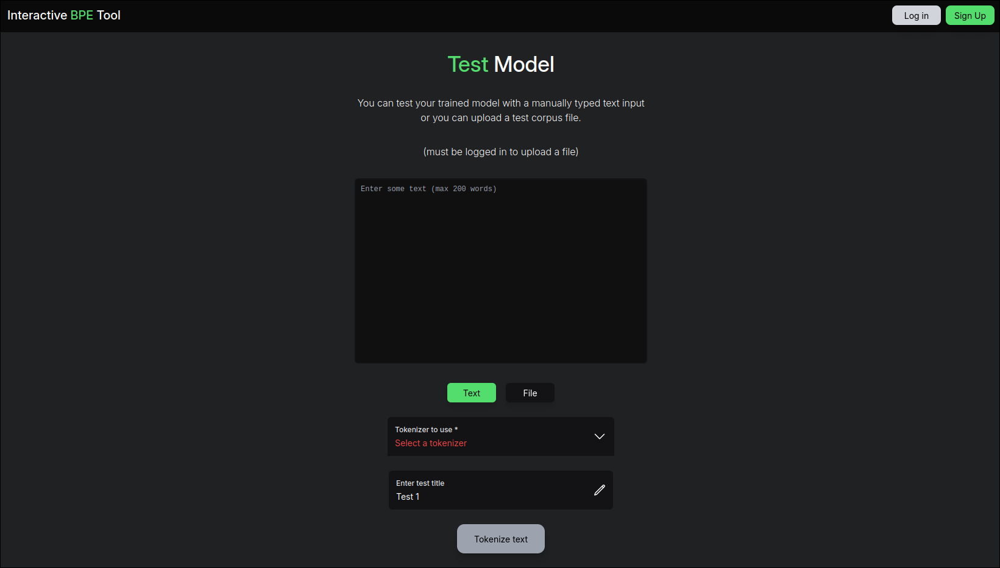
</div>

On this page, the following must be done:

3. Input the text to be tokenized in the text box.
4. Select the default model from the "Tokenizer to use" dropdown.

After this is completed, the page should look like the following:

<div align=left>
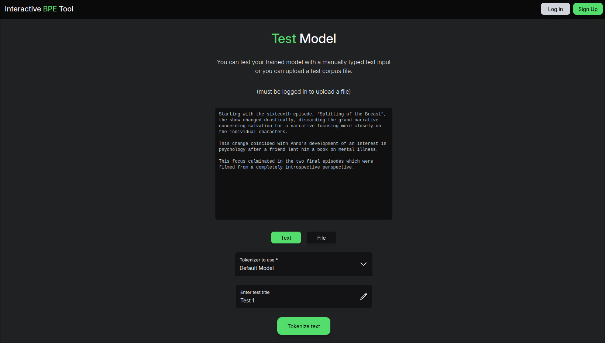
</div>

Finally by clicking on the tokenize text button, a loading page will be shown and eventually the tokenized output.

<div align=left>
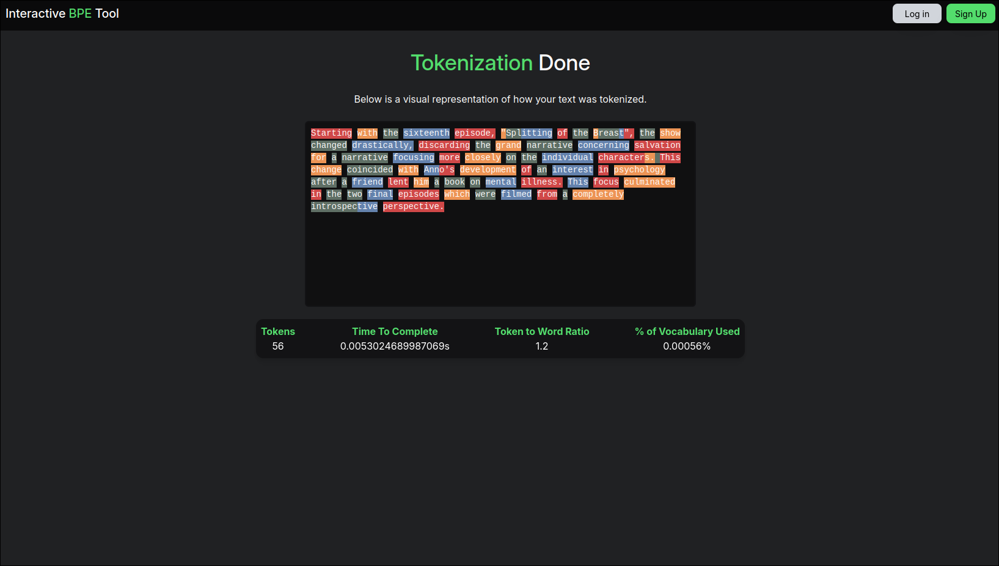
</div>

### Registering an account

In order to register an account, you must click on the sign up button in the top right of the website.

You will be presented with the following menu:

<div align=left>
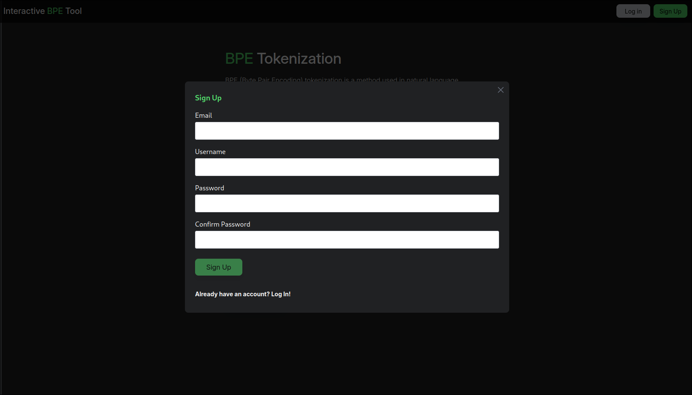
</div>

After filling in the information required, you will be automatically logged into the site.

### Logging in

In order to login with an existing account, you must click on the login button in the top right of the website.

You will be presented with the following login menu:

<div align=left>
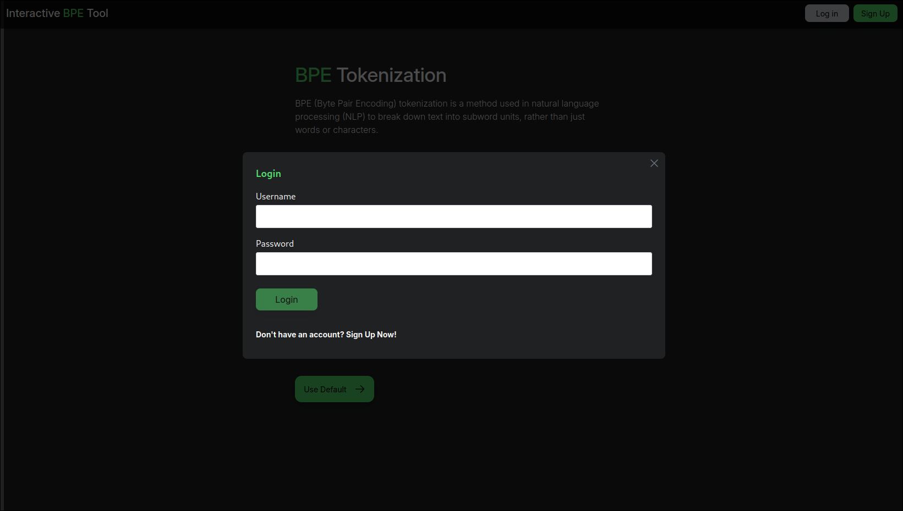
</div>

Clicking the login button after filling in your account details will log you in.

## Usage

From here on, we assume you have registered an account. If not please follow the steps described above to create an account.

### Home screen

After logging in the home screen will change. Three new pages will be available.

<div align=left>
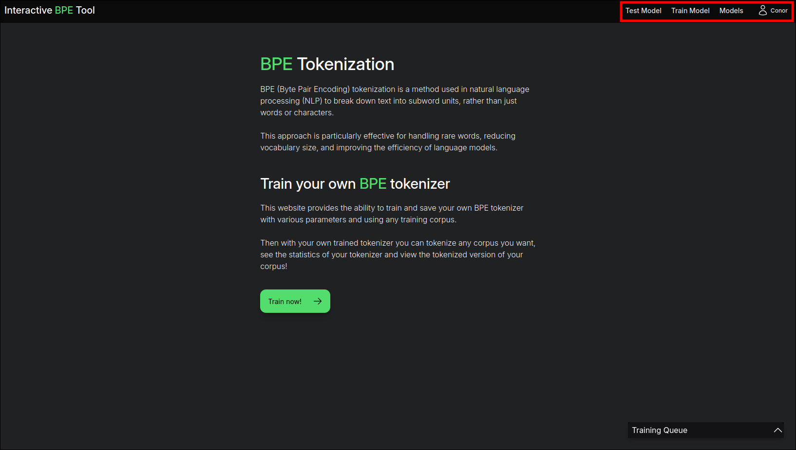
</div>

These pages are:

- Models
  - View all trained models.
- Train Model
  - Create and train a new bpe model.
- Test Model
  - Test a model by tokenizing a text input or text file.

### Training a model

In order to train a model, navigate to the train model page by clicking the button in the navigation bar.

<div align=left>
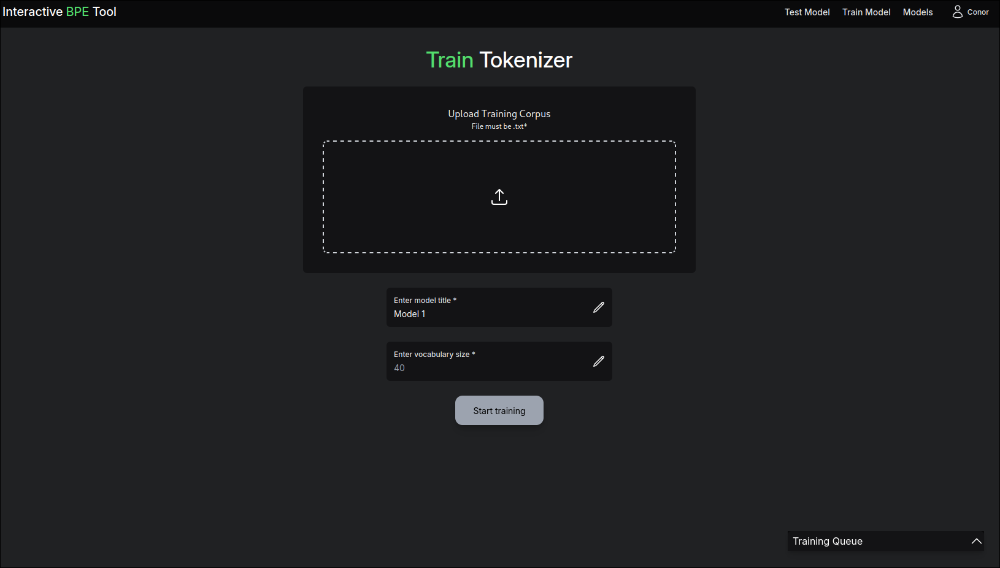
</div>

#### Train a Model Page

The following is a list of all the inputs that must be entered.

- Upload Training Corpus:
  - Clicking on the center of this menu will prompt you to upload a training set.
- Enter model title:
  - This is the title that the model will be saved as under your account.
- Enter vocabulary size:
  - This is the total number of subword tokens that will be attempted to generate from your uploaded training set.

Once all the inputs have been filled in correctly, the "Start training" button will turn green.

Clicking on that button will begin the training process in which the following will be displayed.

<div align=left>
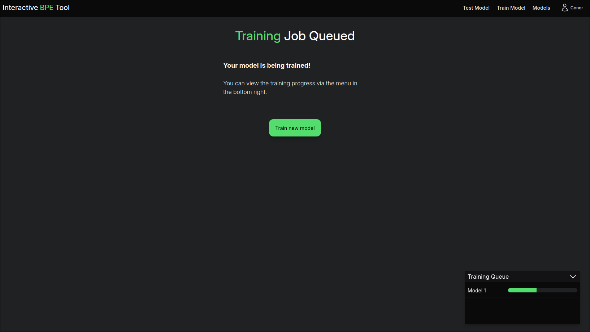
</div>

Once the training queue progress bar is full, the training is completed and can be viewed in the models page.

#### Training Models Information

- Training Queue:
  - You are shown a training queue menu while training.
  - This shows the "progress" of a model being trained.
  - You can only train up to 3 models at a time.
- Training Jobs:
  - There is no need for you to remain on the website once a training job has been submitted.
  - All results will be saved to your account and be accessed at a later time.
- Trained Models:
  - You can only have 20 models trained on your account at once.

### Viewing your trained models

By clicking on the "Models" button in the navigation bar, you will be brought to the Trained Models page.

<div align=left>
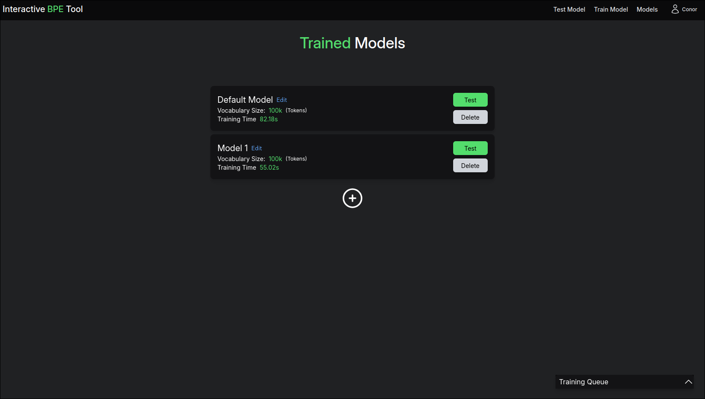
</div>

#### Models Page

On this page you can do the following:

- View all models and their statistics:
  - Vocabulary size (set size when training)
  - Training time (how long it took to train)
- Edit a model:
  - By clicking on the "Edit" button you can change the name of your trained model.
- Delete a model:
  - By clicking on the "Delete" button you can delete your trained model.
- Test a model:
  - By clicking on the "Test" button you can test your model, this takes you to the test model page with that model selected.

### Testing your models

By clicking on the "Test Model" button in the navigation bar, you will be brought the Test Model page.

> You can also select a model from your "Models" page by clicking the "Test" button on a particular model.

<div align=left>
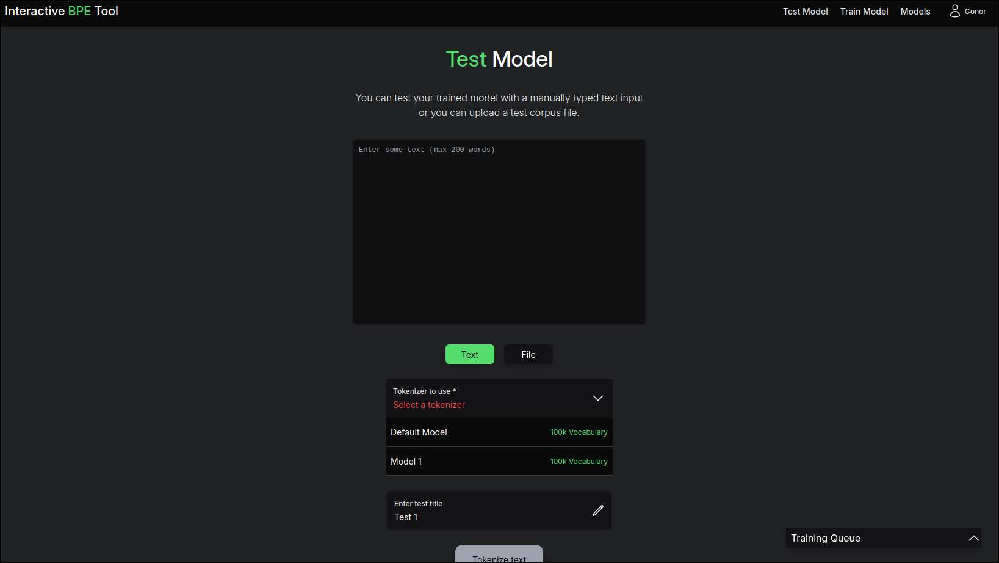
</div>

#### Test Model Page

On this page you can do the following:

- Tokenizer to use:
  - Select your trained model to use.
- Determine input to be tokenized:
  - Either a direct text-input (max 200 words)
  - Or a file input.

After selecting an input type, submitting an input corpus and choosing a model, you can click the now green "Tokenize text" button to tokenize your input

#### Tokenized Output (File Input)

<div align=left>
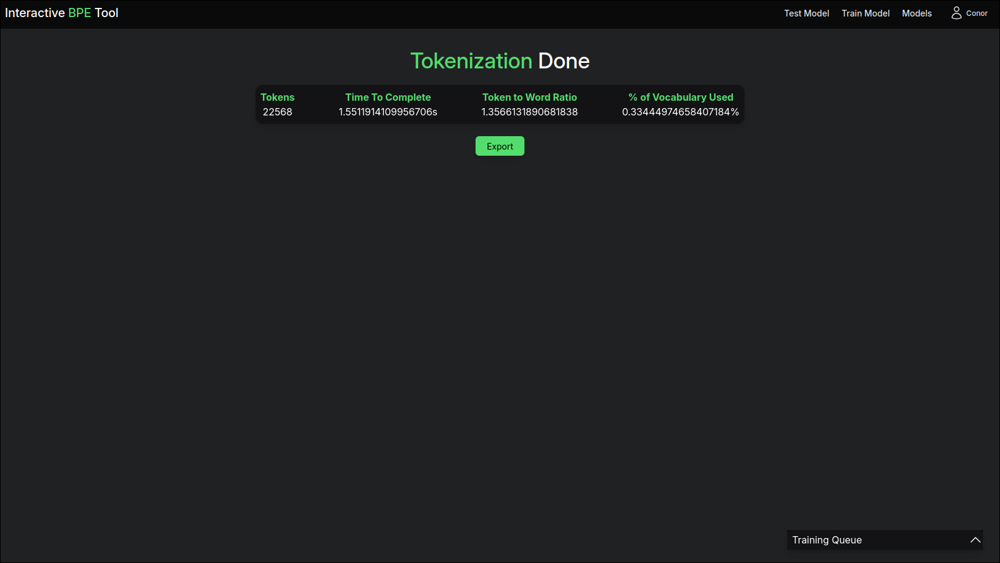
</div>

By using a file as the input, you can export the output file and view it locally.

##### Exported File Explaination

Exporting the output allows you to view how the given input file was broken up into different subwords.

e.g:

```
he did not have fraud_u_lent intent but compassion rather than crimin_ality
```

- A word with no `_`'s means that that entire word exists as a token in the model.
  - e.g: `he` exists as a token in the model.
- A word with `_`'s shows how that word was broken up into multiple tokens.
  - e.g: `fraud_u_lent` shows that the word `fradulent` was broken up into `fraud`, `u`, and `lent`.

#### Tokenized Output (Text Input)

<div align=left>
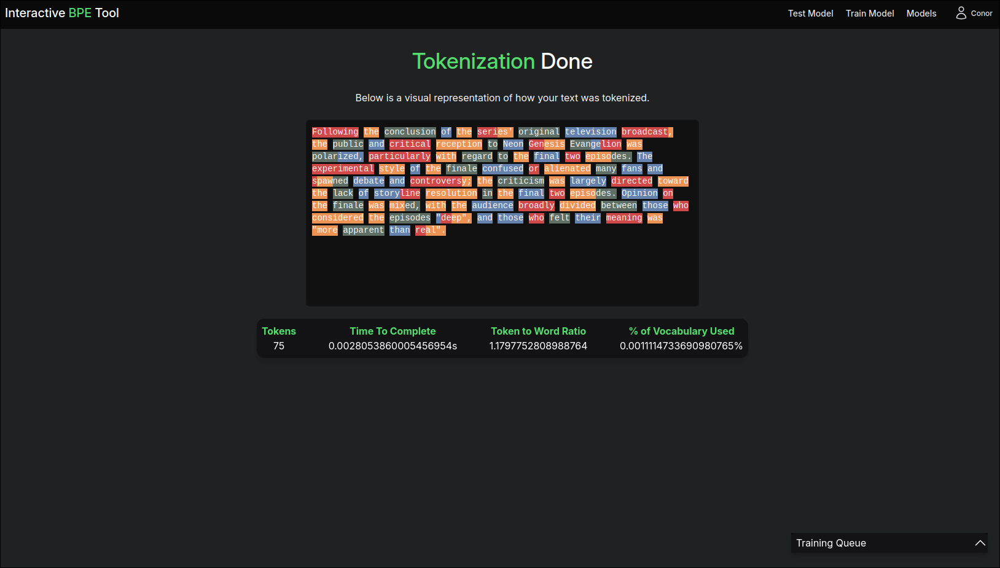
</div>

##### Text Output Explaination

All tokens are highlighted with color showing how they were broken up.

- A word with a single colour means that the entire word exists as a token in the model.
- A word with multiple colours shows how that word was broken up into multiple tokens.

#### Statistics

- Tokens:
  - This shows the number of unique tokens in the text that were found in the model.
- Time to complete:
  - This shows how long the tokenization process took.
- Token to word ratio:
  - This shows the average number of tokens per word from the input text.
- % of vocabulary used:
  - This shows the percentage of tokens that were found during the training process out of the total number of tokens in the model.
